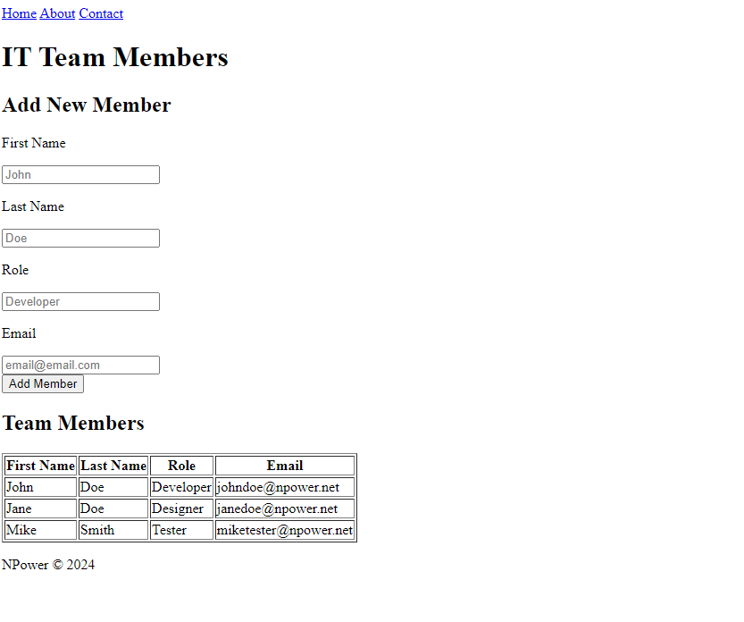

# IT Team Members Webpage

This project is a straightforward HTML webpage aimed at managing IT team members. It facilitates the addition of new members and showcases a list of existing team members.

## Features

The webpage layout includes the following features:

- **Add New Member Form**: A form that allows the input of new team member details, including:
  - **First Name**: A text input for the member's first name.
  - **Last Name**: A text input for the member's last name.
  - **Role**: A text input for the member's role within the team.
  - **Email**: An input specifically for email addresses, ensuring format correctness.

- **Team Members List**: A structured table that displays the details of current team members, such as their first name, last name, role, and email address.

## Instructions

To achieve the expected layout, utilize the `index.html` file located in this folder. Focus on constructing the layout as described; there's no requirement for adding styles or implementing functionality at this stage.

## Notes

- The scope of this project is limited to HTML, excluding dynamic member addition capabilities. It's designed to practice and master layout replication.
- You're encouraged to enhance the design by applying custom styles with CSS, although it's not a requirement for this exercise.

## Expected Output

Below is an image depicting the expected layout of the webpage:

